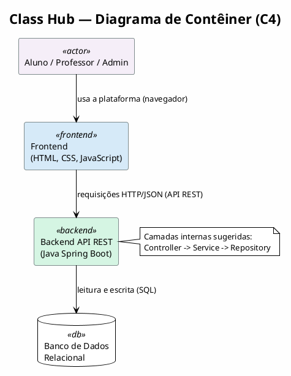

# Architecture — Class Hub

> Fonte: refinamento aprovado em 2026-10-04. Decisões de alto nível em formato de ADR (Architecture Decision Record).

## 1. Visão geral

Arquitetura em 3 camadas, com comunicação via API REST:

```
Frontend (HTML/CSS/JS)  -->  API REST  -->  Backend (Java Spring Boot)  -->  Banco de dados relacional
```

Ver tecnologias e versões em [tech-stack.md](./tech-stack.md).

## 2. Diagrama de contêiner (C4)



## 3. Entidades principais e endpoints da API

Entidades: `Usuario`, `Turma`, `Tarefa`, `Entrega` (com participantes/anexos/comentários), `Feedback`, `Notificacao`.
Regras de negócio completas: ver [business-rules.md](./business-rules.md).

### Autenticação / Usuários
- `POST /auth/login`
- `POST /auth/register` — cria sempre role `aluno`
- `POST /auth/usuarios` — restrito a admin; cria `professor` ou `admin`
- `GET /usuarios` — admin
- `PUT /usuarios/{id}` — admin

### Turmas
- `GET /turmas`
- `POST /turmas`
- `GET /turmas/{id}`
- `PUT /turmas/{id}`
- `DELETE /turmas/{id}`
- `POST /turmas/{id}/alunos/{matricula}` — admin matricula aluno
- `DELETE /turmas/{id}/alunos/{matricula}` — admin remove aluno

### Tarefas
- `GET /tarefas`
- `POST /tarefas`
- `GET /tarefas/{id}`
- `PUT /tarefas/{id}`
- `DELETE /tarefas/{id}`
- `GET /tarefas/{id}/entregas` — professor lista entregas de uma tarefa

### Entregas
- `POST /entregas`
- `PUT /entregas/{id}`
- `GET /entregas/{id}`

### Feedbacks
- `POST /feedbacks`
- `GET /feedbacks/{entregaId}`

### Notificações
- `GET /notificacoes`

### Dashboards
- `GET /dashboard/aluno`
- `GET /dashboard/professor`
- `GET /dashboard/admin`

## 4. Registro de decisões (ADRs)

### ADR-001 — Arquitetura em 3 camadas com API REST
**Status**: Aprovado
**Contexto**: A solução precisa separar frontend, lógica de negócio e persistência.
**Decisão**: Frontend consome uma API REST exposta pelo backend; backend acessa um banco relacional.
**Consequências**: Contratos de API precisam ser versionados/estáveis; acoplamento entre camadas via HTTP/JSON.

### ADR-002 — Unificação de "Projeto acadêmico" e "Tarefa" em uma única entidade
**Status**: Aprovado
**Contexto**: O escopo original citava "Projeto acadêmico = trabalho/tarefa", mas também listava endpoints `/projetos` e `/tarefas` separados.
**Decisão**: Existe uma única entidade de domínio, `Tarefa`. O recurso `/projetos` foi eliminado; `/tarefas` é o recurso canônico.
**Consequências**: Simplifica o modelo de dados e os endpoints; elimina duplicidade de CRUD.

### ADR-003 — Turma como entidade própria, matrícula gerida pelo Admin
**Status**: Aprovado
**Contexto**: Regras de acesso dependiam do conceito de turma, mas ele não tinha endpoints próprios.
**Decisão**: `Turma` é uma entidade com CRUD próprio. O vínculo aluno-turma é criado exclusivamente pelo Administrador.
**Consequências**: Necessário endpoint de matrícula restrito a admin; professor não matricula aluno diretamente.

### ADR-004 — Grupo de entrega sem entidade "Equipe" persistente
**Status**: Aprovado
**Contexto**: "Equipe" estava listada como entidade principal, mas a regra de negócio descrevia apenas inclusão de participantes no momento da entrega.
**Decisão**: Não existe entidade `Equipe`. A entrega guarda diretamente a lista de matrículas participantes.
**Consequências**: Simplifica o modelo; não há pré-formação de grupos antes da entrega.

### ADR-005 — Controle de atribuição de papéis no cadastro (segurança)
**Status**: Aprovado
**Contexto**: Permitir que o próprio usuário escolhesse seu role no cadastro público representa risco de escalonamento de privilégio (OWASP).
**Decisão**: `POST /auth/register` sempre cria usuários com role `aluno`. Criação de `professor`/`admin` exige endpoint restrito, acessível apenas por um admin autenticado.
**Consequências**: Backend deve ignorar/rejeitar qualquer campo de role vindo do payload público; endpoint de criação privilegiada deve validar autenticação e autorização do solicitante.

### ADR-006 — Overwrite de entregas sem versionamento de conteúdo
**Status**: Aprovado
**Contexto**: Era preciso decidir entre manter histórico de versões de entrega ou sobrescrever o conteúdo.
**Decisão**: Reenvio de entrega sobrescreve o conteúdo anterior. Apenas `data_criacao` (primeira submissão) e `data_atualizacao` (último reenvio) são preservadas como metadados.
**Consequências**: Não há recuperação de versões anteriores do conteúdo da entrega.

### ADR-007 — Persistência de dados
**Status**: Aprovado
**Decisão**: Usar PostgreSQL com Hibernate/JPA. Migrations obrigatórias via Flyway, incluindo um script de seed com dados mockados (usuários de cada role, turma, tarefas, entrega, feedback) para a demonstração do MVP.
**Contexto**: Precisamos de integridade referencial entre Usuário, Turma, Tarefa, Entrega e Feedback.
**Consequência para a IA**: Não sugerir bancos NoSQL para este módulo. Sempre gerar script de migration (Flyway) ao alterar o schema.

### ADR-008 — Autenticação mock do MVP
**Status**: Aprovado
**Contexto**: O MVP precisa de autenticação funcional para demonstrar os papéis (aluno/professor/admin), mas sem o custo de configurar Spring Security completo/JWT nesta fase.
**Decisão**: Senhas armazenadas com hash BCrypt. Login gera um token opaco (UUID) guardado em memória no backend, associado ao usuário; demais endpoints exigem o token em um header (`Authorization: Bearer <token>`) e validam o role manualmente no `Controller`/`Service`.
**Consequências**: Tokens não sobrevivem a um restart do backend (aceitável para MVP). Upgrade para Spring Security + JWT fica registrado como pendência em `tech-stack.md`.
